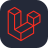

 

  

###

  

  

  

###

<h1 align="center">¡Hola! Soy Jaider Quimbaya 👋</h1>

###

<h3 align="left">✨ Sobre mí</h3>

###

Como desarrollador de software, me motiva la oportunidad de enfrentar retos tecnológicos y encontrar soluciones que aporten valor real. A lo largo de mi carrera, he trabajado en proyectos que combinan diseño y funcionalidad, logrando productos digitales escalables y de alto impacto. Busco un entorno desafiante donde pueda contribuir con mis habilidades y crecer profesionalmente, siempre con la meta de seguir mejorando mis capacidades técnicas.

###

###

<h3 align="left">🔧 Tecnologías que manejo</h3>

###

  
  
  
  
  
  
  
  
  
  
  
  
  
  
  
  
  
  
  
  
  
  
  
  
  
  
  
  
  
  
  
  
  
  
  
  
  
  
  
  
  
  
  
  
  
  
  
  
  
  
  

###

<h6 align="left">¡Gracias por visitar mi perfil! No dudes en contactarme para colaborar en proyectos o compartir ideas. ¡Estoy emocionado por construir grandes cosas juntos! 🌟</h6>

###
